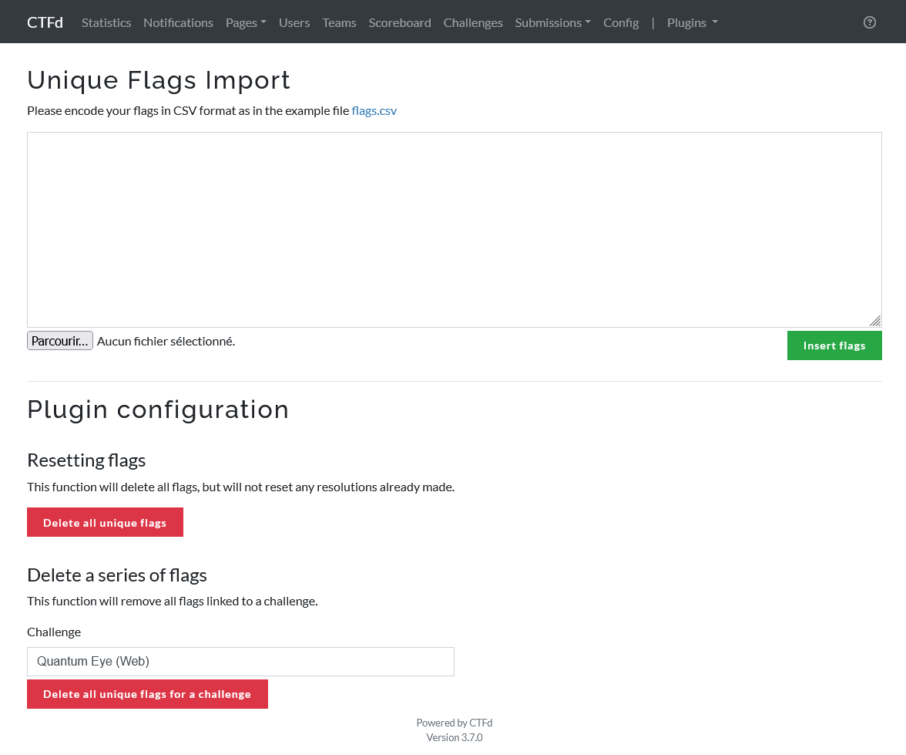
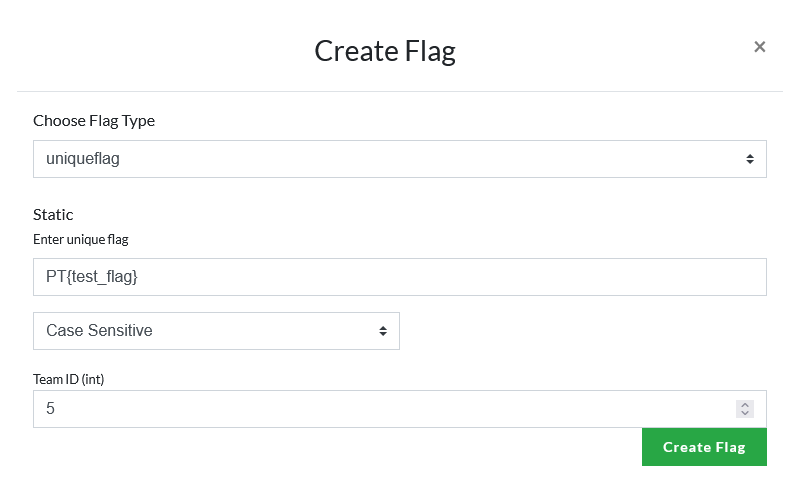
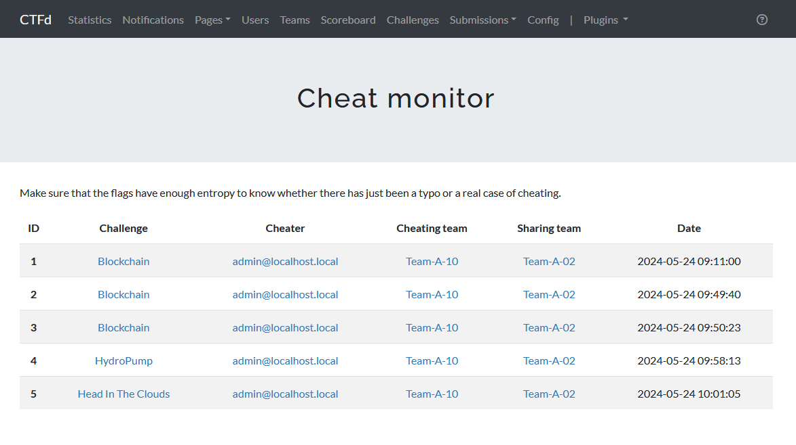
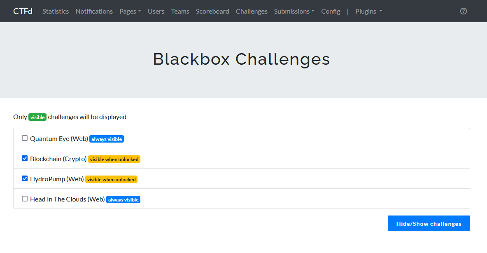
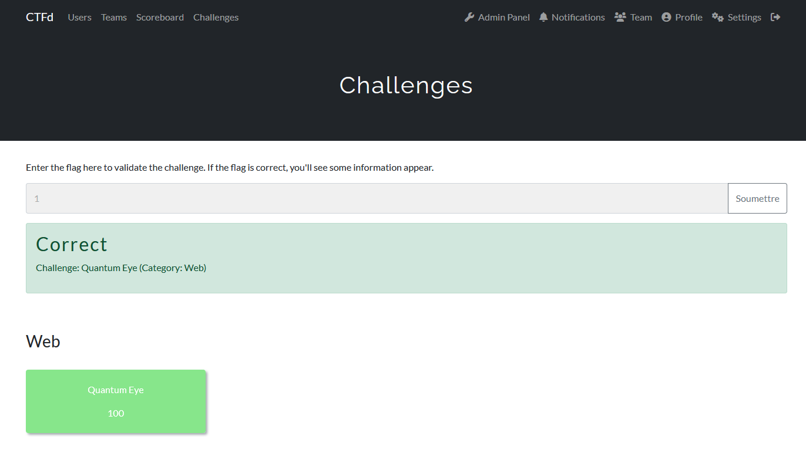
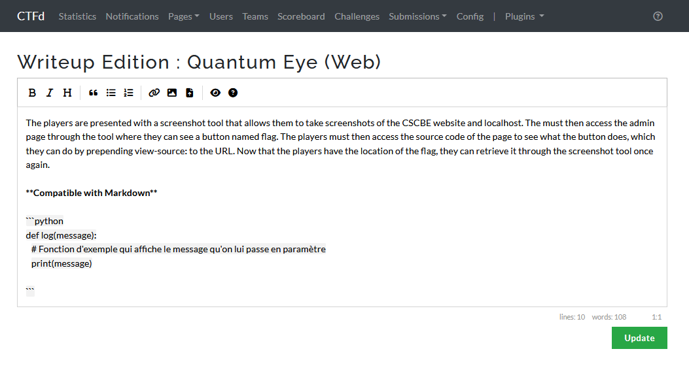
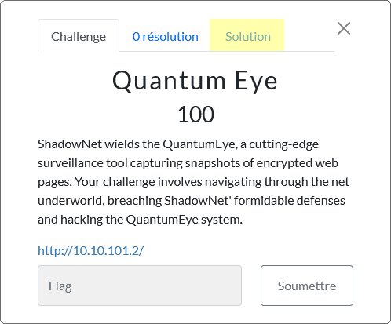
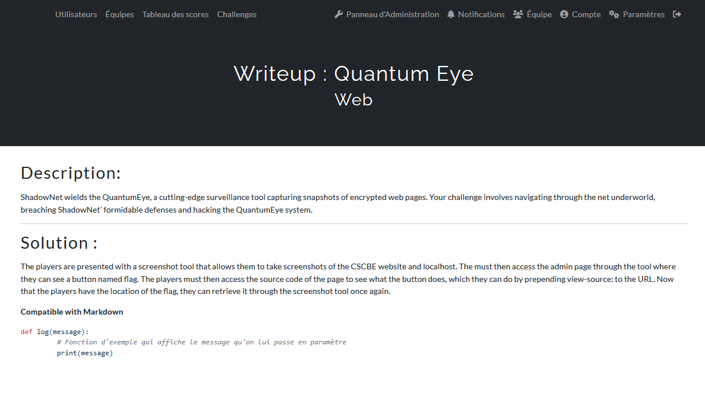

# CTFd-Plugins

## Introduction

This repository contains three CTFd plugins, the first allowing unique flags to be added for each team and cheaters to be detected, a plugin allowing solutions to be given once the challenge has been solved and finally a plugin allowing challenges to be hidden and the challenge to be displayed once it has been solved (blackbox).

## Table of contents

<!-- TOC start (generated with https://github.com/derlin/bitdowntoc) -->

- [Plugin 1 : Unique flags](#plugin-1-unique-flags)
- [Plugin 2 : Universal flag submitter](#plugin-2-universal-flag-submitter)
- [Plugin 3 : Writeup](#plugin-3-writeup)
- [Installation](#installation)
- [Update](#update)
- [Support](#support)
- [Credits](#credits)

<!-- TOC end -->

<!-- TOC --><a name="plugin-1-unique-flags"></a>

## Plugin 1 : Unique flags
This plugin allows you to validate a single flag per team, and you can also import the flags with a CSV file. As each team has its own flag, the plugin is also able to detect cheating.
<details>
  <summary>Screenshots</summary>
  






</details>


<!-- TOC --><a name="plugin-2-universal-flag-submitter"></a>

## Plugin 2 : Universal flag submitter
This plugins will overwrite the default challenge template, and add a way to submit flag trough one forms. This plugin is made for blackbox. An administrator interface is provided to hide challenges from the default interface. Please note that this plugin is not compatible with the requirements and next functions. You need to use Team name generated from the following script `group-csv-generator.py` 

<details>
  <summary>Screenshots</summary>




</details>


<!-- TOC --><a name="plugin-3-writeup"></a>

## Plugin 3 : Writeup
This plugin will add a button to report on each challenge by overwriting a template. The user will be able to see the content of the article after solving it.
The administrator has an interface for adding comments to the database. Text can be written in markdown.

<details>
  <summary>Screenshots</summary>







</details>

<!-- TOC --><a name="installation"></a>
## Installation

1. Copy the desired plugin folder to your CTFd plugins folder

```bash
cp CTFd-<Uniques_flags|Universal_flag_submitter|Writeup> plugins/ -r
```
2. Build the docker image
```bash
docker compose build
```
3. Start the stack


Please read the readme file in each folder for specific installation information. Especially for plugins (Universal flag submitter & Unique flag)

<!-- TOC --><a name="update"></a>
## Update

To update CTFd, change the version number modify the Dockerfile

<!-- TOC --><a name="support"></a>
## Support

For questions, support regarding plugins, please open an issue. If you wish to report a security vulnerability, please follow the [security.md](SECURITY.md) guidelines.

<!-- TOC --><a name="credits"></a>
## Credits

[1] [Isotech42](https://github.com/Isotech42/CTFd-RedHerring) : Cheating monitoring & Part of Unique flags validation